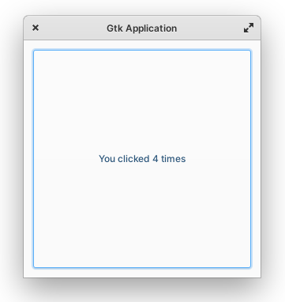

# Gtk-hello

### A simple Gtk Application with a button.

Bored are you? 

Our Application's Button has a solution for it ;)



## Dependencies

```
sudo apt install git valac meson
```

## Build

```
git clone https://github.com/forhooman/gtk-hello.git && cd gtk-hello
meson build --prefix=/usr
cd build && ninja com.github.forhooman.gtk-hello
ninja install
```
